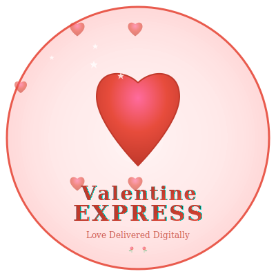

<p align="center">
  <a href="https://github.com/diazjhozua/valentine-express" rel="noopener">
 </a>
</p>

<h3 align="center">Valentine Express 💕</h3>

<div align="center">

[]()
[](https://github.com/diazjhozua/valentine-express/issues)
[](https://github.com/diazjhozua/valentine-express/pulls)
[](/LICENSE)

</div>

---

<p align="center"> A beautiful, responsive web application designed to display romantic Valentine's Day letters with stunning intro slides and interactive features.
    <br>
</p>

## 📝 Table of Contents

- [About](#about)
- [Demo](#demo)
- [Getting Started](#getting_started)
- [Usage](#usage)
- [Features](#features)
- [Built Using](#built_using)
- [Authors](#authors)
- [Acknowledgments](#acknowledgement)

## 🧐 About <a name = "about"></a>

Valentine Express is a romantic web application that creates a memorable digital Valentine's Day experience. It features sequential animated intro slides followed by a customizable love letter with interactive elements like floating hearts and roses. The application is designed to be professional yet romantic, perfect for expressing your love in a unique digital format.

The app includes multiple themes, customizable content, print functionality, and full accessibility support, making it a comprehensive solution for creating personalized romantic messages.

## 🎬 Demo <a name = "demo"></a>

**Live Demo**: [Valentine Express](https://diazjhozua.github.io/valentine-express/)

### ✨ Key Features:

- 🎭 **Intro Slides**: Animated sequence displaying "Hi", "Happy", "Valentine's", "Day", "Babe"
- 💌 **Custom Letters**: Personalized romantic messages with elegant typography
- 🌹 **Interactive Elements**: Floating roses and hearts with click interactions
- 🎨 **Multiple Themes**: Classic, Elegant, and Playful romantic themes
- 📱 **Fully Responsive**: Beautiful on desktop, tablet, and mobile devices
- 🖨️ **Print Ready**: Optimized layouts for physical keepsakes

## 🏁 Getting Started <a name = "getting_started"></a>

These instructions will get you a copy of the project up and running on your local machine.

### Prerequisites

No special prerequisites needed! This is a pure client-side application that runs in any modern web browser.

```
- Modern web browser (Chrome 60+, Firefox 55+, Safari 12+, Edge 79+)
- No build tools or dependencies required
```

### Installing

Getting the project running is simple:

**Option 1: Direct Download**

```bash
# Clone the repository
git clone https://github.com/diazjhozua/valentine-express.git

# Navigate to project directory
cd valentine-express

# Open index.html in your browser
open index.html
```

**Option 2: Local Server (Recommended)**

```bash
# Using Python 3
python -m http.server 8000

# Using Node.js
npx serve .

# Using PHP
php -S localhost:8000
```

Then open `http://localhost:8000` in your browser.

## 🎈 Usage <a name="usage"></a>

### Basic Experience

1. **Launch**: Open the application in your browser
2. **Watch**: Enjoy the animated intro slides
3. **Read**: Experience the romantic letter with animations
4. **Interact**: Click anywhere to spawn floating hearts
5. **Customize**: Use the settings panel to personalize your message

### Keyboard Shortcuts

- **Space/Enter**: Pause/Resume intro slides
- **Escape**: Skip intro or close panels
- **Ctrl+R**: Restart experience
- **Ctrl+P**: Print letter
- **H**: Toggle heart animations

### Customization

1. Click the ⚙️ button to open customization panel
2. Edit intro messages (up to 20 characters each)
3. Modify letter content and signature
4. Choose from 3 romantic themes
5. Save your changes for a personalized experience

## ✨ Features <a name="features"></a>

### 🎬 Visual Experience

- Smooth intro slide transitions with progress indicator
- Elegant typography with responsive design
- Background roses and interactive heart animations
- Multiple romantic color themes

### 🛠️ Technical Features

- Pure vanilla JavaScript (no frameworks)
- CSS custom properties for easy theming
- Local storage for settings persistence
- Full accessibility support (WCAG AA compliant)
- Print-optimized layouts

### 📱 Responsive Design

- Mobile-first approach
- Touch-friendly interactions
- Adaptive layouts for all screen sizes
- Performance optimized animations

## ⛏️ Built Using <a name = "built_using"></a>

- **HTML5** - Semantic markup with accessibility features
- **CSS3** - Modern styling with custom properties and animations
- **Vanilla JavaScript** - ES6+ modules for clean architecture
- **Web APIs** - Intersection Observer, Local Storage
- **Google Fonts** - Dancing Script, Playfair Display, Inter

## ✍️ Authors <a name = "authors"></a>

- **@diazjhozua** - [GitHub Profile](https://github.com/diazjhozua) - Creator & Developer

See also the list of [contributors](https://github.com/diazjhozua/valentine-express/contributors) who participated in this project.

## 🎉 Acknowledgements <a name = "acknowledgement"></a>

- **Google Fonts** for the beautiful typography
- **Unicode Consortium** for emoji hearts and roses
- Inspiration from romantic web experiences and Valentine's Day traditions
- The open-source community for CSS animation techniques

---

<div align="center">

**Made with ❤️ for love**

**Happy Valentine's Day! 💕**

</div>
